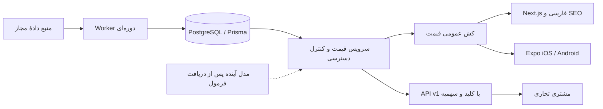

# معماری و بررسی پروژهٔ مرجع

## دامنهٔ محصول

zarsignal.ir نام کوتاه و مرتبط با طلا و تحلیل بازار فارسی است. نام دامنه به‌تنهایی رتبهٔ گوگل یا اعتماد مشتری ایجاد نمی‌کند. برای توسعهٔ بعدی نقره و ارز، عنوان برند «زرسیگنال؛ دیده‌بان طلا، نقره و ارز» در محتوا ثابت بماند. بررسی علامت تجاری انجام نشده است.

Readme نیازهای فارسی، حباب سه بازار، تحلیل و پیش‌بینی، ورود Google/OTP/WhatsApp، موبایل و چت‌بات را شرح می‌دهد. کاربر Prisma، اشتراک و فروش API را اضافه کرده است. فرمول، هزینهٔ پلن‌ها، درگاه و مجوز بازفروش داده مشخص نشده‌اند. لینک گفتگوی اشتراکی باز شد ولی متن قابل بازیابی نداشت.

## مرجع nardarena

مسیر پیدا‌شده: `D:/Windows.old/Users/Navid/Desktop/nardarena-source/Minimal_TypeScript_v6.0.1`.

بازبینی محدود به فایل‌های مشخص زیر است، نه ممیزی کل پروژه:

- `apps/frontend/package.json`: Next 14، React 18، MUI/Emotion، RTL، SWR و نمودارها.
- `apps/backend/package.json`: NestJS 10، Prisma 5، Passport/Google/JWT، Swagger و Throttler.
- `apps/backend/src/app.module.ts`: ماژول‌های تفکیک‌شدهٔ auth/users/SEO/monitoring، scheduler و محافظ درخواست سراسری.
- `apps/backend/src/database/prisma.service.ts`: lifecycle دیتابیس، ثبت رویداد و middleware مالی. شمارندهٔ reference در حافظه برای چند replica کافی نیست؛ این الگو منتقل نشده است.
- `apps/backend/prisma/schema.prisma`: PostgreSQL، کاربران و ثبت تراکنش‌های مرتبط با دامنهٔ همان محصول.

از مرجع، تفکیک لایهٔ داده و سرویس، Prisma، کنترل دسترسی و نیاز به پایش گرفته شده است. کد بازی/کیف‌پول و نسخه‌های قدیمی وابستگی‌ها منتقل نشده‌اند. قالب Minimal کپی نشده؛ طراحی CSS مستقل است. هیچ داده یا کلید خصوصی از پروژهٔ مرجع استفاده نشده است.

## تصمیم فعلی

Next App Router + React + TypeScript برای صفحات قابل crawl و تعاملات کوچک سمت مرورگر. Prisma 6 روی PostgreSQL برای نسخهٔ آغازین انتخاب شده؛ ارتقا به major بعدی باید جداگانه همراه تغییر adapter و تست انجام شود. نسخهٔ دقیق وابستگی‌های حل‌شده در package-lock.json ثبت می‌شود.

بک‌اند فعلی سرویس‌های مجزای TypeScript پشت Route Handlerهای Next است، **NestJS نیست**. پردازشگر قیمت پروسه‌ای جدا دارد. این مرحله هزینهٔ هماهنگی چند سرور را کم می‌کند و API مشترک وب/موبایل فراهم می‌کند. پس از تثبیت auth و billing، می‌توان همین مرزهای سرویس را به NestJS منتقل کرد؛ بهتر است پیش از تولید تصمیم نهایی استقرار گرفته شود.

## مقیاس و عملیات

کش ۶۰ ثانیه‌ای خواندن دیتابیس و cache header عمومی برای CDN پیاده شده است. روی چند instance از Next، کش مشترک هنوز نصب نشده؛ Redis/cache handler و invalidation هماهنگ نیاز است. درخواست‌های احراز هویت‌شده no-store هستند. API عمومی نیاز به rate limit روی reverse proxy/WAF دارد؛ سهمیهٔ API تجاری جایگزین محافظت از کلیدهای نامعتبر و DDoS نیست.

برای تولید: Node LTS، TLS، CDN، PgBouncer/connection budget، محدودیت اتصال، محدودیت حجم درخواست، محدودسازی OTP، پایش lag منبع، لاگ ساختاریافته، backup و restore drill، تست بار سناریوی واقعی و آزمون خرابی منبع لازم‌اند. هیچ ادعای تعداد کاربران هم‌زمان بدون اندازه‌گیری نمی‌شود. پرداخت باید مبلغ و محصول را از سرور بخواند، callback را نزد provider تأیید کند و با providerReference یکتا و تراکنش، subscription را فقط یک‌بار فعال کند. schema پایه موجود است؛ منطق پرداخت هنوز موجود نیست.

## SEO و کشف محتوا

صفحات اختصاصی شش نماد، متن فارسی SSR، canonical، sitemap و robots پیاده شده‌اند. قیمت ساختگی برای index شدن منتشر نمی‌شود. در حالت demo موتورهای جستجو مسدودند؛ بعد از اتصال داده و دامنه، MARKET_MODE=live و NEXT_PUBLIC_SITE_URL=https://zarsignal.ir تنظیم شود. مقاله‌های اصیل، معرفی روش تحلیل، نویسنده/بازبین، تاریخ ویرایش واقعی، Search Console و structured data منطبق با محتوای واقعی مراحل بعدند. قابل‌کشف‌شدن توسط موتورهای هوش مصنوعی تضمینی نیست.

## موبایل و فروش اشتراک

پایهٔ Expo از نسخه‌های template رسمی در زمان ایجاد استفاده می‌کند. پوسته مستقل است و داده را از API مشترک می‌خواند. انتشار با نام و شناسهٔ ir.zarsignal.app پیشنهادی است؛ حساب فروشگاه، امضا و امکان فعالیت تجاری هنوز بررسی نشده‌اند. قواعد پرداخت دیجیتال اپ‌استور و کانال انتشار اندروید باید پیش از انتخاب provider و پیاده‌سازی خرید مرور شوند؛ یک لینک درگاه وب را نمی‌توان بدون بررسی قواعد، جایگزین خرید درون‌برنامه‌ای دانست.

## منابع بررسی‌شده

- https://nextjs.org/docs/app/getting-started/installation
- https://nextjs.org/docs/app/guides/self-hosting
- https://docs.expo.dev/router/introduction/
- https://developer.apple.com/app-store/review/guidelines/#in-app-purchase
- https://hamrate.com/

نرخ‌های صفحهٔ منبع برای واردکردن دستی در محصول کپی نشدند. داده‌های demo عمداً ثابت و برچسب‌دارند.
